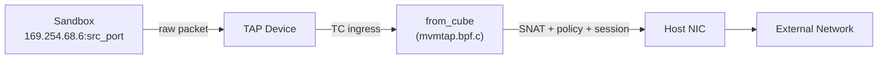
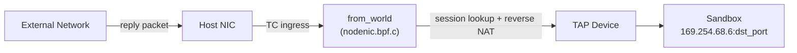
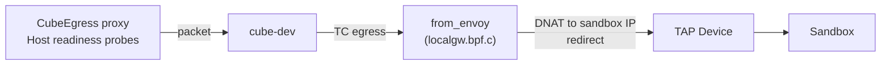
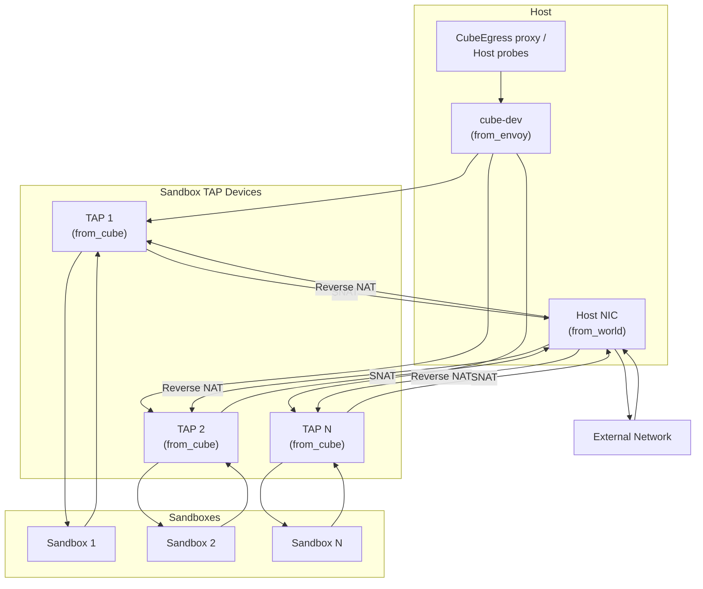

# Network (CubeVS)

Cube-Sandbox isolates each sandbox with its own virtual network, giving every instance private connectivity to the outside world while enforcing per-sandbox security policies entirely in kernel space. The subsystem that makes this possible is **CubeVS** -- a purpose-built network virtualization layer composed of three eBPF programs, a set of shared BPF maps, and a Go control-plane library.

This document explains the architecture, traffic paths, NAT model, policy engine, and lifecycle management that together form the CubeVS network.

---

## 1. Architecture Overview

### 1.1 Design Goals

Traditional container networking stacks (Linux Bridge, OVS, iptables-based NAT) add per-packet overhead that grows with the number of tenants on a host. CubeVS replaces that stack with three small, cooperating eBPF programs attached at strategic points in the kernel data path:

- **No shared bridge or software switch** -- Each sandbox is directly attached to the kernel data path through its own TAP device, avoiding the broadcast domain and per-hop cost of bridge-based designs.
- **Kernel-space policy enforcement** -- Network policies are evaluated in eBPF before a packet ever reaches userspace, keeping CPU overhead minimal.
- **Scalable NAT** -- SNAT port allocation uses a lock-protected pool with collision-resistant insertion, avoiding the iptables rule explosion that plagues large deployments.

### 1.2 The Three BPF Programs

CubeVS attaches one BPF program to each of the three network boundaries a packet can cross on a host:

| Program | File | Attach Point | Direction | Role |
|---------|------|-------------|-----------|------|
| `from_cube` | `mvmtap.bpf.c` | TC ingress on each TAP device | Sandbox --> Host | Policy check, DNS inspection, SNAT, session creation, ARP proxy |
| `from_world` | `nodenic.bpf.c` | TC ingress on host NIC | External --> Host | Reverse NAT, port-mapping proxy |
| `from_envoy` | `localgw.bpf.c` | TC egress on cube-dev | Host --> Sandbox | Handle host-side traffic to sandboxes: transparent-proxy replies (CubeEgress) and host-originated probes |

### 1.3 The Go Control Plane

The `cubevs/` Go package wraps the BPF lifecycle:

- **`Init()`** loads and pins the three BPF object files, injects host-specific constants (IPs, MACs, interface indices), and attaches the shared TC filters.
- **`AddTAPDevice()` / `DelTAPDevice()`** register and deregister sandbox TAP devices, including their metadata and network policies (both CIDR-based and domain-based).
- **`AttachFilter()`** creates the clsact qdisc on a TAP device and attaches the `from_cube` TC filter.
- **`SetSNATIPs()`** populates the SNAT IP pool.
- **Port-mapping APIs** (`AddPortMapping`, `DelPortMapping`, ...) update the port-mapping tables at runtime.
- **Reapers** run as background goroutines: one sweeps expired NAT sessions, another sweeps expired DNS-learned policy entries.

### 1.4 BPF Maps

The three programs share state through pinned BPF maps under `/sys/fs/bpf/`. They fall into six functional groups:

| Group | Maps | Purpose |
|-------|------|---------|
| Device registry | `mvmip_to_ifindex`, `ifindex_to_mvmmeta` | IP-to-device and device-to-metadata lookups for each sandbox |
| NAT sessions | `egress_sessions`, `ingress_sessions` | Bidirectional 5-tuple session tracking (see §3) |
| SNAT pool | `snat_iplist` | SNAT IPs and per-IP source-port waterlines |
| Port mappings | `remote_port_mapping`, `local_port_mapping` | Static NAT rules for services the sandbox exposes (see §7) |
| L3/L4 policy | `allow_out_v2`, `deny_out` | Per-sandbox CIDR allow/deny lists (see §5) |
| L7 / domain policy | `dns_allow`, `dns_query_track` | Per-sandbox domain rules and pending DNS query state (see §6) |

Entries in `allow_out_v2` carry an optional expiration, which lets DNS-learned rules share the map with statically configured ones.

Maps are pinned so that programs loaded at different times (for example, per-TAP filters loaded after `Init()`) can share state through the filesystem.

---

## 2. Traffic Flows

### 2.1 Egress: Sandbox to External Network

When a sandbox process opens a connection to the outside world, the packet takes the following path:

**Step by step:**

1. The sandbox sends a packet with source IP `169.254.68.6` (the fixed internal address) and a source port chosen by its TCP/UDP stack.
2. The packet enters the TAP device and hits the `from_cube` TC ingress filter.
3. `from_cube` checks the destination. If it is the sandbox gateway (`169.254.68.5`), the filter redirects the packet into `cube-dev` so the host stack can handle it.
4. For all other destinations, `from_cube`:
   - **Evaluates network policy** against the destination IP (see §5). Traffic that policy has marked for inspection by the L7 transparent proxy (CubeEgress) is redirected into `cube-dev` instead of being NATed directly; the host-side proxy picks it up from there.
   - **Inspects DNS queries** on the way out, so that domain-based rules (see §6) can learn the resolved IPs when the response comes back.
   - **Creates or updates a NAT session** in `egress_sessions` and `ingress_sessions`.
   - **Performs SNAT**: replaces the sandbox source IP and port with an IP from the SNAT pool and a dynamically allocated port, updating L3 and L4 checksums.
   - **Redirects** the rewritten packet to the host NIC.

### 2.2 Ingress: External Network to Sandbox

Reply packets and port-mapped inbound connections arrive at the host NIC and are routed back to the correct sandbox:

`from_world` handles two cases:

- **Session-based reverse NAT** -- The filter looks up the packet's 5-tuple in `ingress_sessions`. If a match is found, it reconstructs the original sandbox-side 5-tuple, performs reverse DNAT, and redirects the packet to the correct TAP device.
- **Port-mapped inbound** -- If no session matches, the filter checks `remote_port_mapping` using the destination port. A match means this is an inbound connection to a service the sandbox is exposing; the filter DNATs the packet to the sandbox's listen port and redirects to the TAP.

### 2.3 Host-to-Sandbox Traffic

Two kinds of host-side traffic reach a sandbox through `cube-dev`, both handled by `from_envoy`:

In both cases `from_envoy` rewrites the destination to the sandbox's internal IP (`169.254.68.6`) and redirects the packet to the sandbox's TAP. The two cases differ in how the source address is handled:

- **CubeEgress proxy replies.** When outbound HTTP/HTTPS from the sandbox is redirected to the L7 transparent proxy (CubeEgress) on the host, CubeEgress relays the connection to the real remote server and receives the reply. It then forwards the reply back into the sandbox through `cube-dev`, keeping the real remote IP as the source (via `IP_TRANSPARENT`). `from_envoy` **preserves this source IP**, so the sandbox sees the reply as if it came directly from the remote peer.
- **Host-originated probes.** The host itself sends readiness and liveness probes to sandbox services. These packets originate from the host stack and leave through `cube-dev` with cube-dev's own address as the source. `from_envoy` **rewrites the source to the sandbox gateway** (`169.254.68.5`), so the sandbox sees the probe as coming from its default gateway.

---

## 3. Session Tracking

CubeVS maintains stateful connection tracking so that reply packets can be correctly reverse-NATed and so that stale connections are cleaned up.

### 3.1 Dual-Map Design

Two maps work in tandem:

- **`egress_sessions`** is the primary session table. The key is the original 5-tuple as seen from the sandbox side. The value holds the full NAT state: SNAT IP and port, TAP ifindex, timestamps, TCP state, and a flag for active-close handling.
- **`ingress_sessions`** is the reverse-lookup table. The key is the 5-tuple as seen from the external side. The value stores just enough information to reconstruct the `egress_sessions` key and perform the reverse NAT.

This dual-map approach avoids duplicating the full session state in both directions while still enabling efficient O(1) lookups from either side of the connection.

### 3.2 Protocol Tracking

CubeVS mirrors the Linux kernel's `nf_conntrack` for TCP: it tracks the standard states (`SYN_SENT`, `ESTABLISHED`, `FIN_WAIT`, `TIME_WAIT`, ...) so that a session's timeout reflects its protocol state -- `ESTABLISHED` sessions can safely live for hours, while half-open sessions and closed sessions are reaped in seconds to minutes. UDP and ICMP use a simpler two-state model (`UNREPLIED` / `REPLIED`), with the timeout extending when the first reply arrives.

### 3.3 Session Reaper

A Go background goroutine runs every 5 seconds and walks `egress_sessions`. For each session it compares `now - access_time` against a state-specific timeout:

| Protocol | State | Timeout |
|----------|-------|---------|
| TCP | SYN_SENT / SYN_RECV | 1 minute |
| TCP | ESTABLISHED | 3 hours |
| TCP | FIN_WAIT | 2 minutes |
| TCP | CLOSE_WAIT | 1 minute |
| TCP | LAST_ACK | 30 seconds |
| TCP | TIME_WAIT | 2 minutes (10 seconds if the sandbox initiated the close) |
| TCP | CLOSE | 10 seconds |
| UDP | UNREPLIED / REPLIED | 30 s / 180 s |
| ICMP | Any | 30 seconds |

When a session expires, the reaper deletes both the `egress_sessions` and `ingress_sessions` entries. If the session was not in a normal terminal state (for example, `ESTABLISHED` timing out without a FIN), the reaper logs a warning. It also monitors session count and alerts when occupancy exceeds 80% of the map's capacity.

---

## 4. SNAT and DNAT

### 4.1 SNAT: Outbound Address Translation

Every outbound packet from a sandbox must be rewritten with a routable source address before it can leave the host. CubeVS performs this in `from_cube` using a pool of up to four SNAT IPs.

**IP selection** is deterministic per sandbox: `index = jhash(sandbox_ip) % 4`. All connections from the same sandbox therefore use the same SNAT IP, which simplifies external firewall rules and logging.

**Port allocation** works as a monotonically increasing waterline per SNAT IP entry, starting at port 30000. The entry is protected by a BPF spin lock so concurrent allocations on different CPUs do not race. If the chosen `SNAT-IP:port` collides with an existing entry in `ingress_sessions`, the allocator bumps the port and retries a bounded number of times before dropping the packet.

After a successful allocation, `from_cube` updates the IP and transport headers in place and redirects the packet to the host NIC.

### 4.2 DNAT: Inbound Address Translation

DNAT occurs in three contexts:

1. **Host-to-sandbox traffic** (`from_envoy` on cube-dev) -- The destination IP is rewritten to the sandbox's internal IP (`169.254.68.6`). The source is either preserved (CubeEgress proxy replies) or rewritten to the sandbox gateway (host-originated probes); see §2.3.
2. **Session reply traffic** (`from_world` on host NIC) -- The destination IP and port are rewritten from the node's SNAT address back to the sandbox's original source address and port, using the reverse-lookup in `ingress_sessions`.
3. **Port-mapped traffic** (`from_world` on host NIC) -- For services exposed via port mapping, the destination is rewritten to the sandbox's listen port using `remote_port_mapping` directly, without touching the session tables.

---

## 5. Network Policy (CIDR-based)

CubeVS enforces per-sandbox outbound network policies entirely in kernel space, using LPM (Longest Prefix Match) tries for CIDR-based rules.

### 5.1 Architecture

Each sandbox can have two LPM tries associated with its TAP device:

- **`allow_out_v2`** -- An allow list of destination CIDRs. If the destination matches, the packet is allowed regardless of the deny list. Entries can carry an expiration, which is how DNS-learned rules (§6) coexist with static ones in the same map.
- **`deny_out`** -- A deny list of destination CIDRs. If the destination matches (and it was not in the allow list), the packet is dropped.

Both are implemented as hash-of-maps keyed by TAP ifindex, so policy updates for one sandbox never touch the maps belonging to other sandboxes.

### 5.2 Evaluation Order

For each outbound packet:

1. If the destination is the sandbox gateway (`169.254.68.5`): allow (internal traffic).
2. If `allow_out_v2` has a matching entry: allow.
3. If `deny_out` has a matching entry: drop.
4. Otherwise: allow.

The priority is **allow > deny > default-allow**, so an operator can install a broad deny rule (`0.0.0.0/0`, blocking all internet access) and then punch specific holes with allow rules.

Regardless of policy configuration, CubeVS always denies the following private and link-local ranges so that a sandbox cannot probe the host's internal network or other sandboxes: `10.0.0.0/8`, `127.0.0.0/8`, `169.254.0.0/16`, `172.16.0.0/12`, `192.168.0.0/16`.

### 5.3 Policy Configuration

When a TAP device is registered, the caller provides an `MVMOptions` struct with:

- `AllowInternetAccess` -- if `false`, a blanket `0.0.0.0/0` deny rule is installed.
- `AllowOut` / `DenyOut` -- lists of CIDRs (or, for `AllowOut`, domain names -- see §6).

Policies can be updated at runtime by modifying the inner LPM tries without detaching or reloading BPF programs.

---

## 6. Network Policy (Domain-based)

CIDR rules are not enough when a service's IPs are dynamic (CDNs, cloud APIs). CubeVS therefore also supports **domain-based** allow rules that are learned from the sandbox's own DNS traffic.

### 6.1 How It Works

Domain rules are stored per sandbox in `dns_allow`, an LPM trie keyed by reversed lower-case domain name. Two shapes are supported:

- Exact match, for example `qq.com` -- matches only `qq.com`.
- Wildcard prefix, for example `*.qq.com` -- matches subdomains such as `a.qq.com` but not the apex.

When the sandbox sends a DNS query, `from_cube` extracts the queried name and looks it up in `dns_allow`. If the name is allowed, the query id and source port are recorded in `dns_query_track`. When the response comes back, `from_world` matches it against `dns_query_track`, extracts the A-records, and inserts each resolved IP into the sandbox's `allow_out_v2` with an expiration derived from the DNS TTL. The DNS reaper sweeps expired entries in the same way the NAT session reaper sweeps stale connections.

Because DNS-learned rules land in the same `allow_out_v2` map as static CIDRs, the fast path in §5 does not need any special case for them.

### 6.2 Zero Cost When Unused

DNS interception is opt-in per sandbox. Both `from_cube` and `from_world` gate the entire DNS pipeline on a single flag in the sandbox's metadata (`dns_policy_flags`), which is set only when the caller configures domain rules. If it is not configured, DNS packets take the ordinary UDP path with no extra parsing, no `dns_query_track` bookkeeping, and no per-packet lookup into `dns_allow`. Sandboxes that only use CIDR policy pay nothing for the domain-policy machinery.

---

## 7. Port Mapping

Sandboxes are not directly reachable from outside the host. When a sandbox needs to expose a service, CubeVS provides port mapping -- a static NAT rule that forwards traffic arriving at a specific host port to a specific sandbox port.

### 7.1 Dual Mappings

Two BPF maps support port mapping:

- **`remote_port_mapping`** maps a host port to a (TAP ifindex, sandbox listen port) pair. Used by `from_world` to route inbound connections to the right sandbox.
- **`local_port_mapping`** maps (TAP ifindex, sandbox listen port) back to the host port. Used by `from_cube` as an optimization: when a sandbox sends a packet from a mapped listen port, the filter can skip full session creation and directly SNAT to the node IP with the correct port.

### 7.2 Inbound Flow

1. An external client sends a packet to `node_ip:host_port`.
2. `from_world` looks up `remote_port_mapping[host_port]`.
3. On a match, the filter rewrites the destination to `169.254.68.6:sandbox_listen_port` and redirects to the TAP device.

This path does not create entries in the session tables, which keeps the maps lean for long-lived service connections.

### 7.3 Management

The Go API provides `AddPortMapping()`, `DelPortMapping()`, `ListPortMapping()`, and `GetPortMapping()` for managing mappings at runtime.

### 7.4 Compute-Node Port Allocation

To prevent collisions between subsystems, the host's usable port space is partitioned into three ranges:

| Port range | Purpose |
|------------|---------|
| `10000`--`19999` | Host ephemeral ports (`ip_local_port_range`) |
| `20000`--`29999` | Ports CubeProxy uses to reach sandboxes |
| `30000`--`65535` | Source ports used by SNAT for sandbox-originated traffic |

---

## 8. TAP Device Lifecycle

Each sandbox gets a dedicated TAP device that serves as its sole network interface on the host side. CubeVS manages the full lifecycle of these devices.

**Registration.** When the sandbox runtime creates a new sandbox, it calls `AddTAPDevice(ifindex, ip, id, version, options)`, which writes the sandbox's metadata into `ifindex_to_mvmmeta` and `mvmip_to_ifindex`, and initializes the per-sandbox policy maps (CIDR and domain rules) from `options`. The always-denied CIDRs from §5.2 are installed first, then any caller-specified rules.

**Filter attachment.** Once the TAP device exists at the OS level, `AttachFilter(ifindex)` creates a clsact qdisc on it and attaches the `from_cube` TC filter. From this point on, every packet the sandbox sends is intercepted.

**Teardown.** `DelTAPDevice(ifindex, ip)` removes the per-sandbox policy maps and the device-registry entries. Active sessions referencing this TAP device are left in place -- the session reaper cleans them up when they time out, which avoids an expensive full-map scan at teardown time.

---

## 9. Initialization

`Init()` is called once when the network agent starts. It loads and pins the three BPF programs and their maps under `/sys/fs/bpf/`, injecting host-specific values (sandbox IP and gateway IP, cube-dev interface index/IP/MAC, host NIC interface index/IP/MAC, next-hop gateway MAC) into the BPF bytecode before load. It then attaches the shared TC filters: `from_envoy` to cube-dev's egress, and `from_world` to the host NIC's ingress. Per-TAP `from_cube` filters are attached later, one at a time, as sandboxes are created (§8).

---

## 10. ARP Proxy

Sandboxes are assigned a link-local IP (`169.254.68.6`) with `169.254.68.5` as their default gateway. Since these addresses exist only inside the TAP device's point-to-point link, there is no real host at `169.254.68.5` to answer ARP requests -- and, unlike a bridge-based setup, there is no shared L2 segment on which such a request could be flooded.

`from_cube` acts as the ARP responder: when the sandbox asks *"Who has 169.254.68.5?"*, the filter constructs an ARP reply on the fly, filling in the sender MAC with the cube-dev gateway MAC, and redirects it back out the TAP. The sandbox now has a valid ARP entry for its gateway and can send IP packets normally, all of which are then handled by the egress path in §2.1.

---

## 11. Summary

CubeVS achieves sandbox network isolation through a three-layer eBPF architecture:

The design rests on two ideas:

- **Data-path logic lives in the kernel.** Policy evaluation, NAT, session tracking, DNS learning, and ARP resolution all happen in eBPF; the Go control plane only manages lifecycle and periodic cleanup.
- **Each sandbox is isolated end-to-end.** Its own TAP device, its own policy maps, its own sessions -- no shared bridge or switch stands between two sandboxes on the same host.
