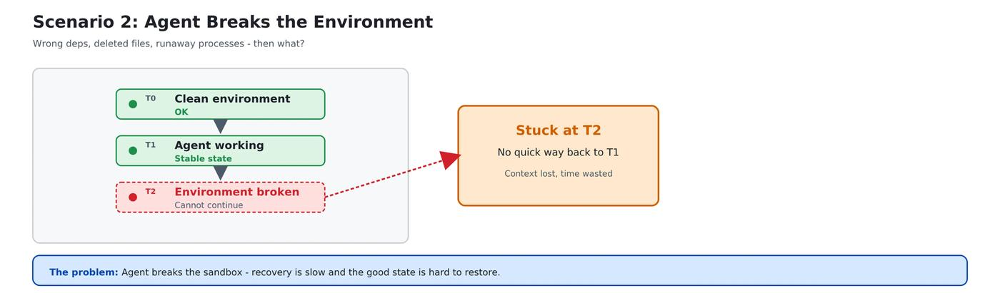
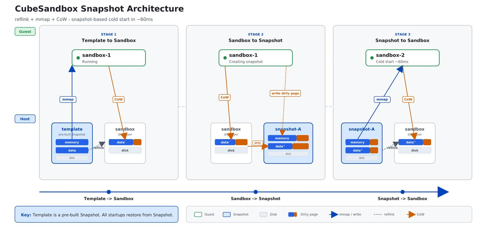
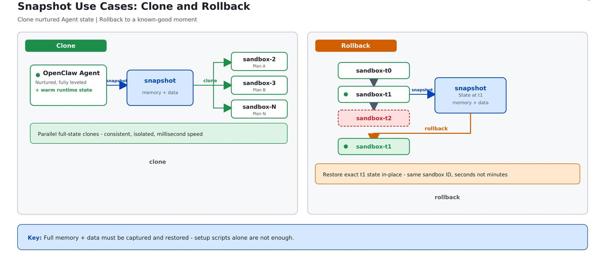

# Cube Sandbox v0.3.0: A Time Machine and a Cloning Booth for Your AI Agents

In modern AI Agent stacks, the sandbox plays the role of a "secure runtime" — it is what actually executes the code and tool calls produced by the model. Cube Sandbox just shipped v0.3.0. Beyond the 82 commits from 22 contributors, this release is a foundational architecture upgrade targeted squarely at the pain points AI Agents hit at scale: runtime reuse and fault isolation under high concurrency, long task chains, and reinforcement-learning workloads.

## 1. Foundations: a more complete AI Infra story

Before diving into the headline snapshot work, here is what changed at the foundation. v0.3.0 iterates on three axes:

- **Engine internals (cubecow + incremental memory)**: a new copy-on-write (CoW) snapshot engine — `cubecow` — purpose-built for sandbox volumes; on the memory side, an incremental memory snapshot built on the Linux kernel's `soft-dirty` bitmap. In back-to-back snapshot scenarios, the system no longer has to flush full memory; it only persists the dirty pages produced since the last snapshot. As a result, both snapshot creation and restoration drop into the millisecond range per sandbox.

- **Developer ecosystem (Go SDK + WebUI)**: following the Python SDK, Go developers now get a native SDK that fully covers the sandbox and template lifecycle. For ops and management workflows, a built-in web console is now live, surfacing per-node resource load and per-sandbox runtime state at a glance.

- **Deploy & ops**: the one-click installer has migrated to systemd + Docker Compose, with built-in pre-flight and diagnostic scripts (cgroup v2, etc.) that significantly improve out-of-the-box compatibility across cloud providers.

Among these foundational updates, the one that deserves the most attention is the snapshot / rollback / clone system around the sandbox's core state.

## 2. Snapshot / Clone / Rollback: a time machine for your Agent

This release introduces three SDK primitives — `snapshot`, `clone`, and `rollback` — that together form a complete state-management story for sandboxes.

### 2.1 What each primitive does

**`snapshot` — freeze the current state**

Dump the running sandbox's memory, runtime state, and disk to persistent storage as a standalone snapshot file. The snapshot's lifecycle is decoupled from the source sandbox: the snapshot survives the source's destruction, and the snapshot ID can itself act as a template for spinning up new sandboxes in bulk.

**`clone` — fan one sandbox out into N**

A single call derives N fully independent replicas from a running source sandbox. The key properties:

- **Inheritance**: each replica starts from a state identical to the source — memory, files, connections.
- **Isolation**: replicas are physically isolated from each other.
- **Continuity**: the source sandbox is unaffected and keeps running.

The interface ships with a `concurrency=C` knob and an "abort-and-clean-up on any failure" policy, so large fan-outs never leave orphan sandboxes behind.

**`rollback` — go back to a moment in one line**

A sandbox can be restored in place to a previous snapshot's state — both memory and filesystem fully reverted. After rollback, the `sandbox_id` and the sandbox object stay the same; no reconnection or reconstruction needed.

### 2.2 Why Agents really need these

In a classic web service, a container is largely stateless: spin up, serve, throw away. AI Agents do not work that way — they are *cultivated*. Two recurring pain points fall out of that:

**First: how do you replicate a sandbox you have already "trained up"?**

When you need to run more tasks in parallel, or onboard a new teammate, replaying the setup script from scratch is both slow and unable to faithfully reproduce in-memory context, loaded model weights, or warm caches. With `snapshot + clone`, "thirty minutes × N" becomes "milliseconds × N", and every replica is a fully primed Agent environment.


**Second: what happens when the environment gets wrecked?**

Agents make mistakes — wrong dependencies, deleted files, infinite loops. The traditional answer is "kill the container, rebuild from the image, re-run pip install" — a few minutes lost. `rollback` collapses recovery from minutes to a few hundred milliseconds, with the same `sandbox_id`, so the Agent simply keeps going.



### 2.3 Four real-world scenarios these primitives unlock

**1) Agentic RL training / SWE-Bench evaluation**

- **Pain**: you need a large number of independent runs from the same baseline, and every experiment must be reproducible.
- **Cube approach**:

  ```python
  # Prepare the baseline environment
  base = Sandbox.create(template=TEMPLATE_ID)
  base.run_code("# Install deps, download dataset ...")
  snap = base.create_snapshot()

  # Fan out 100 independent instances in parallel
  clones = Sandbox.create(template=snap.snapshot_id).clone(n=100, concurrency=10)
  ```

- **Value**: the baseline is built once; every subsequent expansion is a millisecond-grade clone.

**2) Parallel multi-strategy exploration**

- **Pain**: you want to try several solution paths against the same problem at the same time.
- **Cube approach**: use `clone(n=N)` to fork the current state into N isolated sandboxes, run each strategy independently, then aggregate.
- **Value**: linear scaling of exploration throughput, with strict experimental parity across runs.

**3) Agent trial-and-retry loops**

- **Pain**: when one step fails mid-execution, the classic remedy is to kill the sandbox and start over.
- **Cube approach**:

  ```python
  checkpoint = sb.create_snapshot()
  sb.run_code("# Try approach A ...")
  if failed:
      sb.rollback(checkpoint.snapshot_id)   # Back to the moment before A
      sb.run_code("# Retry with a different approach ...")
  ```

- **Value**: no environment rebuild — saves time and resources, and maps naturally onto the Agent's trial-and-error pattern.

**4) Long-lived environment reuse**

- **Pain**: you have configured a complex dev environment (lots of dependencies) and don't want to set it up again every time.
- **Cube approach**: take a snapshot once; create every future sandbox from that snapshot.
- **Value**: cold start + environment init collapse into a single step.

## 3. How snapshots actually work under the hood

In traditional virtualization, snapshots are a heavy ops operation. Cube Sandbox's snapshot system uses `reflink` end-to-end at the storage layer, paired with copy-on-write (CoW) semantics, to deliver efficient snapshot creation and cloning.



- **Storage model**: while a sandbox is running, its disk data is mounted in CoW mode, and its memory is similarly `mmap`'d from the snapshot file in CoW mode. Once a sandbox boots, all read-only memory pages map directly to the underlying snapshot file — multiple sandbox instances share one physical copy of the data with no duplication.

- **Taking a snapshot**: when a new snapshot is taken for a running sandbox, the system writes only the dirty pages produced since the last snapshot into a new snapshot file — no full serialization, no full write-out. Since dirty pages are typically an order of magnitude smaller than total memory, snapshot I/O cost drops dramatically and end-to-end latency falls.

- **Booting from a snapshot**: when creating a new sandbox from an existing snapshot, `reflink` lets the new instance reference the snapshot's metadata blocks directly — a true "logical copy" with no full data duplication. Filesystem-level reflink is roughly O(1), which makes cold-starting a sandbox from a snapshot extremely fast.

On top of this storage primitive, the SDK wraps `clone` and `rollback` as simple, single-line operations:



## 4. In practice: using snapshot and rollback

### Scenario 1: error isolation and in-place rollback

Drop a checkpoint at any meaningful moment in the sandbox's lifecycle. No matter how badly the environment is later mangled, a single `sb.rollback(checkpoint_id)` restores it to that moment — and crucially, the `sandbox_id` and the sandbox object stay the same, so you can keep using them:

```python
from cubesandbox import Sandbox
from env import TEMPLATE_ID

# Step 1: take a base snapshot in the v0 state
with Sandbox.create(template=TEMPLATE_ID) as src:
    src.run_code("open('/tmp/v.txt', 'w').write('v0')")
    base = src.create_snapshot()
    base_id = base.snapshot_id
    print(f"base snapshot (v0): {base_id}")

# Step 2: spin up a new sandbox from the base snapshot
sb = Sandbox.create(template=base_id)
print(f"derived sandbox: {sb.sandbox_id}")

# Step 3: write v1 and drop a checkpoint
sb.run_code("open('/tmp/v.txt', 'w').write('v1')")
checkpoint = sb.create_snapshot()
checkpoint_id = checkpoint.snapshot_id
print(f"checkpoint (v1): {checkpoint_id}")

# Step 4: write v2 and confirm it landed
sb.run_code("open('/tmp/v.txt', 'w').write('v2')")
before = sb.run_code("print(open('/tmp/v.txt').read())").logs.stdout
before = before[0].strip() if before else ""
print(f"before rollback: {before!r}")
assert before == "v2"

# Step 5: roll back to the v1 checkpoint
sb.rollback(checkpoint_id)
print(f"rolled back to checkpoint {checkpoint_id}")

# Step 6: verify state is restored to v1 (sandbox_id unchanged)
after = sb.run_code("print(open('/tmp/v.txt').read())").logs.stdout
after = after[0].strip() if after else ""
print(f"after rollback: {after!r}")
assert after == "v1", f"expected 'v1', got {after!r}"
print("OK: rollback restored state to checkpoint (v1)")

# Cleanup
sb.kill()
Sandbox.delete_snapshot(checkpoint_id)
Sandbox.delete_snapshot(base_id)
print("snapshots deleted")
```

### Scenario 2: parallel exploration via efficient cloning

In reinforcement learning or multi-path decision making, `clone` can derive many environments from a single source sandbox in one call — each replica is physically isolated yet inherits the source's full runtime state. The example below clones N replicas and then verifies each one inherited a marker file written into the source:

```python
import os
from cubesandbox import Sandbox
from env import TEMPLATE_ID

N = int(os.environ.get("FORK_N", "10"))
CONCURRENCY = int(os.environ.get("FORK_CONCURRENCY", "5"))

src = Sandbox.create(template=TEMPLATE_ID)
src.run_code("open('/tmp/origin.txt', 'w').write('I am from sandbox a')")
print(f"src sandbox: {src.sandbox_id}")

# ★ Concurrent clone — the SDK fan-outs Sandbox.create internally
clones = src.clone(n=N, concurrency=CONCURRENCY)
print(f"cloned {len(clones)} sandboxes (concurrency={CONCURRENCY})")

# Verify every clone inherited the source's state marker
expect = "I am from sandbox a"
ok = 0
for i, sb in enumerate(clones):
    r = sb.run_code("print(open('/tmp/origin.txt').read())")
    marker = r.logs.stdout[0].strip() if r.logs.stdout else ""
    if marker == expect:
        ok += 1
    print(f"  clone[{i:>2}] {sb.sandbox_id} marker={marker!r}")

print(f"\n{ok}/{N} clones inherited the origin marker")
assert ok == N, "some clones failed to inherit state"

# Cleanup
src.kill()
for sb in clones:
    sb.kill()
print("all sandboxes killed")
```

Cube Sandbox is deeply E2B-compatible at the protocol level, but these two primitives do not exist in E2B's native API. The Cube team bridges them at the application layer through the `cubesandbox` SDK — meaning developers can unlock these advanced state-management primitives without touching their existing E2B-compatible code.

## 5. A web console for snapshot / clone / rollback (preview), open-sourced alongside

In addition to the SDK-level `snapshot` / `rollback` / `clone` API, this release ships an open-source preview of a Cube-Sandbox-powered OpenClaw web console. Everything new in this release is now point-and-click: a real-time snapshot timeline per sandbox, one-click rollback to any checkpoint, on-demand fan-out to multiple OpenClaw replicas, and bulk lifecycle management.

What used to require scripting against the SDK — the "time machine" and the "cloning booth" — is now a few clicks in the browser.


## Coming soon

In the next release we will push "sandbox security" one layer further — from "isolating *where* the Agent runs" to "controlling *what* the Agent can touch":

- **Built-in content-aware network control and audit**: content-aware egress access control plus full audit trails at the sandbox network boundary, so "which external API the Agent called and what data it sent out" is fully traceable and interceptable.
- **Credential vault**: API keys, database passwords, and cloud credentials managed centrally on the sandbox security side; the Agent only ever sees scoped, ephemeral credentials, keeping secrets out of the model context and out of logs.

If you are building anything in this space, follow Cube Sandbox — and consider opening an issue or PR to build with us.

- **GitHub repo**: <https://github.com/TencentCloud/CubeSandbox>
- **Full release notes**: <https://github.com/TencentCloud/CubeSandbox/releases/tag/v0.3.0>
- **Snapshot technical docs**: <https://github.com/TencentCloud/CubeSandbox/blob/master/docs/guide/snapshot-rollback-clone.md>
