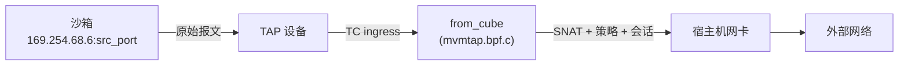
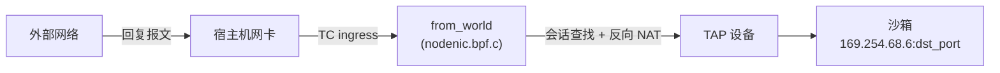
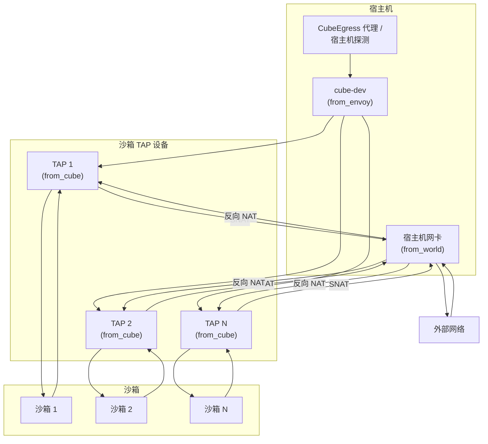

# 网络模型 (CubeVS)

Cube-Sandbox 为每个沙箱提供独立的虚拟网络，使其拥有私有的外部连接能力，同时完全在内核态执行每沙箱的安全策略。实现这一切的子系统称为 **CubeVS** —— 一个专为沙箱场景设计的网络虚拟化层，由三个 eBPF 程序、一组共享的 BPF Map 和一个 Go 控制面库组成。

本文档介绍 CubeVS 的整体架构、流量路径、NAT 模型、策略引擎以及设备生命周期管理。

---

## 1. 架构概览

### 1.1 设计目标

传统的容器网络方案（Linux Bridge、OVS、基于 iptables 的 NAT）在每个报文上都会引入额外开销，并且开销会随主机上租户数量的增长而加剧。CubeVS 用三个精简的 eBPF 程序取代了这一整套网络栈，它们被挂载在内核数据路径的关键位置上，协同工作：

- **无共享网桥与软件交换机** —— 每个沙箱通过专属 TAP 设备直接接入内核数据路径，避免了基于网桥的方案所引入的广播域与每跳开销。
- **内核态策略执行** —— 网络策略在 eBPF 中完成评估，报文无需到达用户态，CPU 开销极低。
- **可扩展的 NAT** —— SNAT 端口分配使用带自旋锁保护的资源池和防碰撞插入机制，避免了大规模部署中 iptables 规则膨胀的问题。

### 1.2 三个 BPF 程序

CubeVS 在报文可能经过的三个网络边界上各挂载一个 BPF 程序：

| 程序 | 源文件 | 挂载点 | 方向 | 职责 |
|------|--------|--------|------|------|
| `from_cube` | `mvmtap.bpf.c` | 各 TAP 设备的 TC ingress | 沙箱 --> 宿主机 | 策略检查、DNS 拦截、SNAT、会话创建、ARP 代理 |
| `from_world` | `nodenic.bpf.c` | 宿主机网卡的 TC ingress | 外部 --> 宿主机 | 反向 NAT、端口映射代理 |
| `from_envoy` | `localgw.bpf.c` | cube-dev 的 TC egress | 宿主机 --> 沙箱 | 处理宿主机侧发往沙箱的流量：透明代理（CubeEgress）回包与宿主机就绪/存活探测 |

### 1.3 Go 控制面

`cubevs/` Go 包封装了 BPF 的生命周期管理：

- **`Init()`** 加载并固定三个 BPF 目标文件，向 BPF 字节码注入宿主机相关的常量（IP、MAC、接口索引），并挂载共享 TC 过滤器。
- **`AddTAPDevice()` / `DelTAPDevice()`** 注册和注销沙箱 TAP 设备，包括其元数据以及网络策略（CIDR 与域名规则）。
- **`AttachFilter()`** 在 TAP 设备上创建 clsact qdisc，并挂载 `from_cube` TC 过滤器。
- **`SetSNATIPs()`** 填充 SNAT IP 池。
- **端口映射 API**（`AddPortMapping`、`DelPortMapping` 等）在运行时更新端口映射表。
- **回收器** 以后台 goroutine 方式运行：一个清理过期的 NAT 会话，另一个清理过期的 DNS 学习策略条目。

### 1.4 BPF Map

三个程序通过固定在 `/sys/fs/bpf/` 下的 BPF Map 共享状态。这些 Map 按功能划分为六组：

| 分组 | Map | 用途 |
|------|-----|------|
| 设备注册表 | `mvmip_to_ifindex`、`ifindex_to_mvmmeta` | 沙箱的 IP-到-设备、设备-到-元数据查找 |
| NAT 会话 | `egress_sessions`、`ingress_sessions` | 双向五元组会话跟踪（见 §3） |
| SNAT 池 | `snat_iplist` | SNAT IP 及每个 IP 的源端口水位线 |
| 端口映射 | `remote_port_mapping`、`local_port_mapping` | 沙箱对外暴露服务的静态 NAT 规则（见 §7） |
| L3/L4 策略 | `allow_out_v2`、`deny_out` | 每沙箱的 CIDR 允许/拒绝列表（见 §5） |
| L7 / 域名策略 | `dns_allow`、`dns_query_track` | 每沙箱的域名规则与 DNS 查询待响应状态（见 §6） |

`allow_out_v2` 中的条目可携带可选的过期时间，使 DNS 学习出来的规则与静态规则共存于同一个 Map。

所有 Map 通过文件系统固定，使得在不同时间加载的程序（例如 `Init()` 之后才加载的每 TAP 过滤器）能够共享状态。

---

## 2. 流量路径

### 2.1 出站：沙箱到外部网络

当沙箱进程发起到外部的连接时，报文经过以下路径：

**详细步骤：**

1. 沙箱发送报文，源 IP 为 `169.254.68.6`（固定内部地址），源端口由其 TCP/UDP 栈选择。
2. 报文进入 TAP 设备，命中 `from_cube` TC ingress 过滤器。
3. `from_cube` 检查目标。若为沙箱网关（`169.254.68.5`），过滤器将报文重定向到 `cube-dev`，交给宿主机协议栈处理。
4. 对于其他目标，`from_cube` 依次执行：
   - **评估网络策略**（见 §5）。被策略标记为需要经 L7 透明代理（CubeEgress）检查的流量会被重定向到 `cube-dev`，不再走直接 NAT 路径；宿主机侧代理再从那里接手。
   - **拦截 DNS 查询**，供域名策略（见 §6）在响应回来时学习解析出的 IP。
   - **创建或更新 NAT 会话**，写入 `egress_sessions` 与 `ingress_sessions`。
   - **执行 SNAT**：将沙箱源 IP 和端口替换为 SNAT 池中的 IP 及动态分配的端口，同时更新 L3 和 L4 校验和。
   - **重定向**改写后的报文到宿主机网卡。

### 2.2 入站：外部网络到沙箱

回复报文与端口映射的入站连接到达宿主机网卡，被路由回正确的沙箱：

`from_world` 处理两种情况：

- **基于会话的反向 NAT** —— 过滤器在 `ingress_sessions` 中查找报文的五元组。若匹配成功，则重建沙箱侧的原始五元组，执行反向 DNAT，并将报文重定向到对应 TAP 设备。
- **端口映射入站** —— 若会话未匹配，过滤器根据目标端口查找 `remote_port_mapping`。若匹配成功，说明这是沙箱对外暴露服务的入站连接，过滤器将目标 DNAT 到沙箱的监听端口并重定向至 TAP。

### 2.3 宿主机到沙箱流量

宿主机侧有两类流量通过 `cube-dev` 进入沙箱，均由 `from_envoy` 处理：

两种情况下 `from_envoy` 都会将目标改写为沙箱内部 IP（`169.254.68.6`），然后将报文重定向到沙箱的 TAP。差别在于源地址的处理方式：

- **CubeEgress 代理回包。** 当沙箱的出站 HTTP/HTTPS 被重定向到宿主机上的 L7 透明代理（CubeEgress）时，CubeEgress 会代表沙箱与真实远端建立连接、接收响应，然后通过 `cube-dev` 把响应送回沙箱，源 IP 保留为真实的远端地址（借助 `IP_TRANSPARENT`）。`from_envoy` **保留该源 IP**，因此沙箱看到的响应就像是从远端对端直接回来的一样。
- **宿主机发起的就绪/存活探测。** 宿主机自身会向沙箱内的服务发送就绪与存活探测。这类报文来自宿主机协议栈，通过 `cube-dev` 出站，源 IP 是 cube-dev 自身的地址。`from_envoy` **将源地址改写为沙箱网关**（`169.254.68.5`），因此沙箱看到的探测就像是从其默认网关发来的一样。

---

## 3. 会话跟踪

CubeVS 维护有状态的连接跟踪，以确保回复报文能被正确反向 NAT，同时清理陈旧连接。

### 3.1 双 Map 设计

两个 Map 协同工作：

- **`egress_sessions`** 是主会话表。Key 为沙箱侧的原始五元组。Value 保存完整的 NAT 状态：SNAT IP 和端口、TAP ifindex、时间戳、TCP 状态以及主动关闭标志。
- **`ingress_sessions`** 是反向查找表。Key 为外部侧的五元组。Value 仅存储足以重建 `egress_sessions` Key 并完成反向 NAT 的信息。

这种双 Map 方案避免了在两个方向上重复存储完整的会话状态，同时仍能从连接的任意一端实现 O(1) 查找。

### 3.2 协议跟踪

CubeVS 参照 Linux 内核 `nf_conntrack` 实现 TCP 状态跟踪，识别标准状态（`SYN_SENT`、`ESTABLISHED`、`FIN_WAIT`、`TIME_WAIT` 等），使会话超时随协议状态调整 —— `ESTABLISHED` 会话可安全存活数小时，而半打开与关闭中的会话会在数秒到数分钟内被回收。UDP 和 ICMP 使用更简单的两状态模型（`UNREPLIED` / `REPLIED`），首次回复到达后超时会延长。

### 3.3 会话回收器

一个 Go 后台 goroutine 每 5 秒执行一次，遍历 `egress_sessions`。对每个会话，将 `当前时间 - access_time` 与其状态对应的超时值比较：

| 协议 | 状态 | 超时 |
|------|------|------|
| TCP | SYN_SENT / SYN_RECV | 1 分钟 |
| TCP | ESTABLISHED | 3 小时 |
| TCP | FIN_WAIT | 2 分钟 |
| TCP | CLOSE_WAIT | 1 分钟 |
| TCP | LAST_ACK | 30 秒 |
| TCP | TIME_WAIT | 2 分钟（若关闭由沙箱主动发起，则 10 秒） |
| TCP | CLOSE | 10 秒 |
| UDP | UNREPLIED / REPLIED | 30 秒 / 180 秒 |
| ICMP | 任意 | 30 秒 |

会话过期时，回收器同时删除 `egress_sessions` 与 `ingress_sessions` 中的条目。若会话不在正常终止状态（例如 `ESTABLISHED` 未经 FIN 即超时），会记录告警。回收器还会监控会话数量，当占用率超过 Map 容量的 80% 时发出告警。

---

## 4. SNAT 与 DNAT

### 4.1 SNAT：出站地址转换

沙箱的每个出站报文在离开宿主机前，必须将源地址改写为可路由地址。CubeVS 在 `from_cube` 中使用最多四个 SNAT IP 的地址池完成此操作。

**IP 选择** 按沙箱确定性分配：`index = jhash(sandbox_ip) % 4`。这确保同一沙箱的所有连接使用相同的 SNAT IP，简化了外部防火墙规则和日志记录。

**端口分配** 使用每 SNAT IP 条目的单调递增水位线，从端口 30000 开始。条目受 BPF 自旋锁保护，确保不同 CPU 上的并发分配不会产生竞争。若选中的 `SNAT-IP:port` 与 `ingress_sessions` 中的已有条目冲突，分配器会递增端口并有限次数地重试，超出上限则丢弃该报文。

分配成功后，`from_cube` 原地更新 IP 和传输层头部，再将报文重定向到宿主机网卡。

### 4.2 DNAT：入站地址转换

DNAT 发生在三种场景中：

1. **宿主机到沙箱流量**（cube-dev 上的 `from_envoy`）—— 目标 IP 被改写为沙箱内部 IP（`169.254.68.6`）。源地址要么保留（CubeEgress 代理回包），要么改写为沙箱网关（宿主机发起的探测）；详见 §2.3。
2. **会话回复流量**（宿主机网卡上的 `from_world`）—— 目标 IP 和端口从节点的 SNAT 地址改写回沙箱的原始源地址和端口，由 `ingress_sessions` 中的反向查找提供转换。
3. **端口映射流量**（宿主机网卡上的 `from_world`）—— 对通过端口映射暴露的服务，目标直接根据 `remote_port_mapping` 改写为沙箱的监听端口，不经过会话表。

---

## 5. 网络策略（基于 CIDR）

CubeVS 完全在内核态执行每沙箱的出站网络策略，使用 LPM（最长前缀匹配）Trie 实现基于 CIDR 的规则。

### 5.1 架构

每个沙箱可以为其 TAP 设备关联两个 LPM Trie：

- **`allow_out_v2`** —— 目标 CIDR 的允许列表。若目标匹配，报文将被放行，不再检查拒绝列表。条目可携带过期时间，DNS 学习出来的规则（§6）正是通过这种方式与静态规则共存于同一个 Map。
- **`deny_out`** —— 目标 CIDR 的拒绝列表。若目标匹配（且未在允许列表中），报文将被丢弃。

两者均实现为以 TAP ifindex 为 Key 的 Hash-of-Maps，因此一个沙箱的策略更新不会触及其他沙箱的 Map。

### 5.2 评估顺序

对于每个出站报文：

1. 若目标为沙箱网关（`169.254.68.5`）：放行（内部流量）。
2. 若 `allow_out_v2` 中有匹配条目：放行。
3. 若 `deny_out` 中有匹配条目：丢弃。
4. 否则：放行。

优先级为 **允许 > 拒绝 > 默认放行**，因此运维人员可以设置宽泛的拒绝规则（例如 `0.0.0.0/0` 阻止所有互联网访问），然后通过允许规则开放特定白名单。

无论策略如何配置，CubeVS 始终拒绝以下私有和链路本地地址段，以避免沙箱探测宿主机内部网络或其他沙箱：`10.0.0.0/8`、`127.0.0.0/8`、`169.254.0.0/16`、`172.16.0.0/12`、`192.168.0.0/16`。

### 5.3 策略配置

注册 TAP 设备时，调用方提供 `MVMOptions` 结构体，其中包含：

- `AllowInternetAccess` —— 若为 `false`，安装 `0.0.0.0/0` 全面拒绝规则。
- `AllowOut` / `DenyOut` —— CIDR 列表（对于 `AllowOut`，也可以是域名 —— 见 §6）。

策略可在运行时通过修改内层 LPM Trie 进行更新，无需卸载或重新加载 BPF 程序。

---

## 6. 网络策略（基于域名）

当服务的 IP 是动态的（CDN、云 API），单纯的 CIDR 规则就不够用了。为此 CubeVS 还支持 **基于域名** 的允许规则，规则条目从沙箱自身的 DNS 流量中学习得来。

### 6.1 工作方式

域名规则按沙箱存放在 `dns_allow` 中，这是一个以反转小写域名为 Key 的 LPM Trie。支持两种形式：

- 精确匹配，例如 `qq.com` —— 只匹配 `qq.com` 本身。
- 通配前缀，例如 `*.qq.com` —— 匹配 `a.qq.com` 等子域名，但不匹配顶级域名本身。

沙箱发出 DNS 查询时，`from_cube` 从中提取查询名并到 `dns_allow` 中查找。若域名被允许，就将该次查询的 id 与源端口记入 `dns_query_track`。响应回来时，`from_world` 在 `dns_query_track` 中匹配，提取 A 记录，并将每个解析出的 IP 写入该沙箱的 `allow_out_v2`，过期时间取自 DNS TTL。DNS 回收器按与 NAT 会话回收器一致的方式清理过期条目。

因为 DNS 学习出来的规则落在与静态 CIDR 相同的 `allow_out_v2` 里，§5 中的快路径无需为它们做任何特殊处理。

### 6.2 未启用时零开销

DNS 拦截是逐沙箱按需启用的。`from_cube` 与 `from_world` 都用沙箱元数据里的一个标志（`dns_policy_flags`）作为总闸门 —— 只有当调用方为该沙箱配置了域名规则时，这个标志才会被置位。若未配置，DNS 报文走普通 UDP NAT 路径，不做任何额外解析，不写 `dns_query_track`，也不查询 `dns_allow`。只使用 CIDR 策略的沙箱不会为域名策略的机制付出任何代价。

---

## 7. 端口映射

沙箱无法从宿主机外部直接访问。当沙箱需要暴露服务时，CubeVS 提供端口映射 —— 一条静态 NAT 规则，将到达宿主机特定端口的流量转发到沙箱的特定端口。

### 7.1 双向映射

两个 BPF Map 支撑端口映射：

- **`remote_port_mapping`** 将宿主端口映射到（TAP ifindex，沙箱监听端口）。`from_world` 用它将入站连接路由到正确的沙箱。
- **`local_port_mapping`** 将（TAP ifindex，沙箱监听端口）映射回宿主端口。`from_cube` 将其用作优化：当沙箱从已映射的监听端口发送报文时，过滤器可跳过完整的会话创建，直接将报文 SNAT 到节点 IP 的正确端口。

### 7.2 入站流程

1. 外部客户端发送报文到 `node_ip:host_port`。
2. `from_world` 查找 `remote_port_mapping[host_port]`。
3. 若匹配，过滤器将目标改写为 `169.254.68.6:sandbox_listen_port` 并重定向到 TAP 设备。

此路径不会在会话表中创建条目，使 Map 在长连接服务场景下保持精简。

### 7.3 管理

Go API 提供了 `AddPortMapping()`、`DelPortMapping()`、`ListPortMapping()` 和 `GetPortMapping()`，用于在运行时管理映射关系。

### 7.4 计算节点端口分配

为避免不同子系统之间的端口冲突，计算节点上的可用端口被划分为三段：

| 端口范围 | 用途 |
|----------|------|
| `10000`--`19999` | 宿主机临时端口（`ip_local_port_range`） |
| `20000`--`29999` | CubeProxy 访问沙箱所用的端口范围 |
| `30000`--`65535` | 沙箱出站报文经 SNAT 使用的源端口 |

---

## 8. TAP 设备生命周期

每个沙箱获得一个专用的 TAP 设备，作为其在宿主侧的唯一网络接口。CubeVS 管理这些设备的完整生命周期。

**注册。** 沙箱运行时创建新沙箱时调用 `AddTAPDevice(ifindex, ip, id, version, options)`，将沙箱元数据写入 `ifindex_to_mvmmeta` 与 `mvmip_to_ifindex`，并根据 `options` 初始化每沙箱的策略 Map（CIDR 与域名规则）。§5.2 中的始终拒绝 CIDR 先安装，然后是调用方指定的规则。

**过滤器挂载。** TAP 设备在操作系统层面创建后，`AttachFilter(ifindex)` 在其上创建 clsact qdisc 并挂载 `from_cube` TC 过滤器。从此刻起，沙箱发送的每个报文都会被拦截。

**清理。** `DelTAPDevice(ifindex, ip)` 移除每沙箱的策略 Map 与设备注册表条目。引用此 TAP 设备的活跃会话保留在原处 —— 会话回收器会在超时后清理它们，从而避免在销毁时进行代价高昂的全 Map 扫描。

---

## 9. 初始化

`Init()` 在网络代理启动时调用一次，将三个 BPF 程序及其 Map 加载并固定到 `/sys/fs/bpf/` 下。在加载之前，先将宿主机相关的常量（沙箱 IP 与网关 IP，cube-dev 接口索引/IP/MAC，宿主机网卡接口索引/IP/MAC，下一跳网关 MAC）注入到 BPF 字节码中。随后挂载共享 TC 过滤器：`from_envoy` 挂到 cube-dev 的 egress，`from_world` 挂到宿主机网卡的 ingress。每 TAP 的 `from_cube` 过滤器在稍后随沙箱的创建逐个挂载（见 §8）。

---

## 10. ARP 代理

沙箱被分配链路本地 IP（`169.254.68.6`），默认网关为 `169.254.68.5`。由于这些地址仅存在于 TAP 设备的点对点链路内，`169.254.68.5` 处并没有真实的主机来响应 ARP 请求 —— 而且不同于基于网桥的方案，也没有可以泛洪该请求的共享二层网段。

`from_cube` 承担 ARP 应答的角色：当沙箱发出 *"谁是 169.254.68.5？"* 的请求时，过滤器现场构造一份 ARP 回复，将发送方 MAC 填为 cube-dev 网关 MAC，然后沿同一 TAP 送回沙箱。沙箱由此获得默认网关的有效 ARP 条目，可以正常发送 IP 报文，这些报文之后都会走 §2.1 的出站路径。

---

## 11. 总结

CubeVS 通过三层 eBPF 架构实现沙箱网络隔离：

整个设计建立在两点之上：

- **数据面逻辑住在内核里。** 策略评估、NAT、会话跟踪、DNS 学习与 ARP 应答都在 eBPF 中完成；Go 控制面只负责生命周期与定期清理。
- **每个沙箱端到端隔离。** 各自的 TAP 设备、各自的策略 Map、各自的会话 —— 同一宿主机上的两个沙箱之间没有共享的网桥或交换机。
