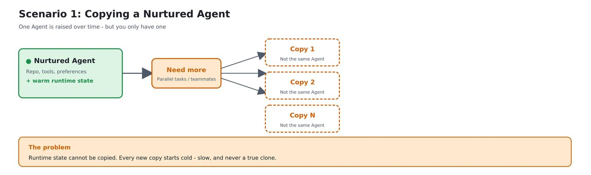
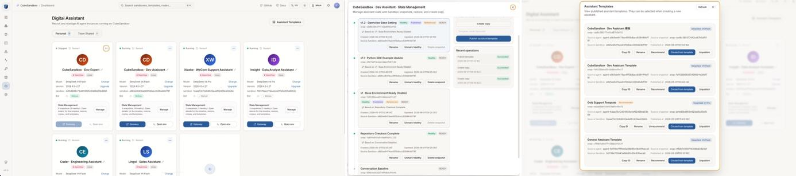

# Cube Sandbox v0.3.0：让 AI Agent 拥有「时光机」和「分身术」

在主流 AI Agent 架构中，沙箱服务承担着"安全运行时"的角色，负责执行模型生成的代码与外部工具调用。近期，Cube Sandbox 发布了 v0.3.0 版本——这一版本由 22 位贡献者合入了 82 个 commits，更是一次面向 AI Agent 高并发、长链路与强化学习场景的关键架构升级，目的是解决 Agent 运行时复用与故障隔离这两个核心痛点。

## 一、基建升级：更完整的 AI Infra 生态

在展开核心的快照能力之前，先看一下 v0.3.0 在基础设施层面的几项重大改进。相比上一个版本，这一版主要在三个维度完成了自我迭代：

- **引擎内核（cubecow 与增量内存）**：新增了专为沙箱卷设计的 cubecow 写时复制（CoW）快照引擎；同时，在内存侧引入了基于 Linux 内核 soft-dirty 机制的增量内存快照。这意味着在连续快照场景下，系统不再需要写出全量内存，仅持久化变化后的脏页，单个沙箱的快照与恢复时间双双降到毫秒级。

- **开发者生态（Go SDK 与 WebUI）**：继 Python SDK 之后，Go 语言开发者在这一版迎来了原生 SDK 支持，完整覆盖沙箱与模板的生命周期管理。同时，针对运维和管理场景，内置的 Web 控制台也正式上线，直观呈现节点资源负载与沙箱运行状态。

- **部署与运维优化**：一键部署脚本完成了向 systemd 与 Docker Compose 的迁移，内置了 cgroup v2 等关键的系统级预检与诊断脚本，大幅提升了在各种云服务器上的环境自适应能力。

在这些基建更新中，最值得展开讲的，是围绕 sandbox 核心状态管理而设计的"快照、回滚与克隆"体系。

## 二、快照 / 克隆 / 回滚：让 Agent 拥有「时光机」

这一版引入的三组 SDK 接口——`snapshot`、`clone`、`rollback`——构成了完整的 sandbox 状态管理。

### 2.1 三组接口分别能干什么

**快照（snapshot）—— 把当前状态存档**

把 running 中沙箱的内存、状态、磁盘整体 dump 到持久化盘，形成独立的快照文件。生命周期与源沙箱解耦：源沙箱销毁后快照仍然可用；快照 ID 还能直接当模板，用来批量启动新沙箱。

**克隆（clone）—— 一个沙箱裂变成 N 个**

一行调用，从一个 running 中的源沙箱派生出 N 个完全独立的副本。这里的核心特性是：

- **继承性**：副本初始状态与源沙箱完全一致，包括内存、文件、连接；
- **隔离性**：副本之间物理隔离；
- **连续性**：源沙箱不受影响，继续运行。

接口内置 `concurrency=C` 并发控制和"任一失败自动清理"，大批量场景下不会留孤儿沙箱。

**回滚（rollback）—— 一行回到过去某一刻**

沙箱可原地恢复到之前某次快照的状态，让内存状态和文件系统完全还原。回滚后，`sandbox_id` 不变、沙箱对象不变，不需要重连、不需要重建。

### 2.2 Agent 真正需要它们的原因

在传统 Web 服务里，容器启动后通常是无状态的，用完即扔。但 AI Agent 不是这个模型——Agent 是被"养"出来的。由此引出两个最常见的痛点：

**第一，"养好"的环境怎么复制？**

并发任务多了需要分身，团队来了新人也要从头养。从零起步重新跑一遍 setup 脚本既慢、也根本无法精确还原内存里的上下文、加载好的模型权重、热起来的缓存。靠 snapshot + clone，"半小时 × N" 变成 "毫秒 × N"，每个副本都是真正满级的 Agent 环境。



**第二，环境被搞坏了怎么办？**

Agent 干活难免出错——装错依赖、误删文件、跑出死循环。传统做法只能销毁容器、从镜像重建、重新 `pip install`，几分钟就这么没了。Rollback 让"出错恢复"这件事从分钟级降到百毫秒级，且 `sandbox_id` 不变，Agent 接着跑。


### 2.3 解锁的四个真实业务场景

**1）Agentic RL 训练 / SWE-Bench 评测**

- **痛点**：需要从同一基线出发跑大量独立实例，且每次实验必须可复现。
- **Cube 解法**：

  ```python
  # 准备基线环境
  base = Sandbox.create(template=TEMPLATE_ID)
  base.run_code("# 安装依赖、下载数据集 ...")
  snap = base.create_snapshot()

  # 一键派生 100 个独立实例，并发创建
  clones = Sandbox.create(template=snap.snapshot_id).clone(n=100, concurrency=10)
  ```

- **价值**：基线只需准备一次，后续扩展是毫秒级克隆操作。

**2）多策略并行探索**

- **痛点**：同一个问题想同时测试多种解题路径。
- **Cube 解法**：用 `clone(n=N)` 从当前状态分叉出 N 个独立沙箱，各跑各的策略，结果汇总后选最优。
- **价值**：探索效率线性提升，且每次实验条件严格一致。

**3）Agent 试错-重试循环**

- **痛点**：Agent 执行过程中某步出错，传统做法是杀掉沙箱从头开始。
- **Cube 解法**：

  ```python
  checkpoint = sb.create_snapshot()
  sb.run_code("# 尝试步骤 A ...")
  if 判断失败:
      sb.rollback(checkpoint.snapshot_id)   # 回到 A 之前
      sb.run_code("# 换一种方式重试 ...")  # 继续前进
  ```

- **价值**：不用重建环境，节省时间和资源；天然适配 Agent 的试错模式。

**4）长期环境留存与复用**

- **痛点**：配置好一套复杂开发环境（装了很多依赖），不想每次都重新搭建。
- **Cube 解法**：做一次快照，之后所有新沙箱直接基于该快照创建。
- **价值**：冷启动 + 环境初始化，两步合成一步。

## 三、快照的技术实现原理

在传统虚拟化中，快照是一项相当沉重的运维操作。Cube Sandbox 的快照系统在后端存储层全面采用 reflink 机制进行数据管理，结合写时复制（CoW，Copy-on-Write）语义，实现了高效的快照创建与克隆能力。


- **存储模型**：沙箱运行期间，磁盘数据以 CoW 模式挂载，内存同样通过对快照文件 `mmap`（内存映射）的方式以 CoW 模式运行。这意味着沙箱启动后，所有只读内存页均直接映射到底层快照文件，多个沙箱实例可以共享同一份物理存储副本，无需复制数据。

- **快照制作**：当需要为运行中的沙箱制作新快照时，系统仅将本次运行产生的增量 dirty page 写入新的快照文件副本，而不进行全量数据的序列化与写出。由于 dirty page 相比沙箱总内存体量通常小一个数量级，快照制作过程的 I/O 开销大幅降低，整体耗时显著缩短。

- **启动沙箱**：基于已有快照创建新沙箱实例时，得益于 reflink 的特性，新实例直接引用快照文件的元数据块，无需拷贝全量数据即可完成"逻辑复制"。文件系统层面的 reflink 操作耗时接近 O(1)，使得从快照冷启动新沙箱的速度极快。

基于底层快照技术，我们在 API 层面包装了 clone / rollback 语义：


## 四、实战：如何使用快照 / 回滚能力

### 场景 1：错误隔离与原地回滚

开发者可以在沙箱运行到关键节点时打一个 checkpoint，之后无论环境被改成什么样，一行 `sb.rollback(checkpoint_id)` 就能原地还原到那一刻——`sandbox_id` 保持不变，沙箱对象可以接着用：

```python
from cubesandbox import Sandbox
from env import TEMPLATE_ID

# Step 1: 在 v0 状态创建一个基础快照
with Sandbox.create(template=TEMPLATE_ID) as src:
    src.run_code("open('/tmp/v.txt', 'w').write('v0')")
    base = src.create_snapshot()
    base_id = base.snapshot_id
    print(f"base snapshot (v0): {base_id}")

# Step 2: 从基础快照拉起一个新沙箱
sb = Sandbox.create(template=base_id)
print(f"derived sandbox: {sb.sandbox_id}")

# Step 3: 写入 v1，打一个 checkpoint
sb.run_code("open('/tmp/v.txt', 'w').write('v1')")
checkpoint = sb.create_snapshot()
checkpoint_id = checkpoint.snapshot_id
print(f"checkpoint (v1): {checkpoint_id}")

# Step 4: 写入 v2，确认已生效
sb.run_code("open('/tmp/v.txt', 'w').write('v2')")
before = sb.run_code("print(open('/tmp/v.txt').read())").logs.stdout
before = before[0].strip() if before else ""
print(f"before rollback: {before!r}")
assert before == "v2"

# Step 5: 回滚到 v1 这个 checkpoint
sb.rollback(checkpoint_id)
print(f"rolled back to checkpoint {checkpoint_id}")

# Step 6: 验证状态已恢复为 v1（sandbox_id 保持不变）
after = sb.run_code("print(open('/tmp/v.txt').read())").logs.stdout
after = after[0].strip() if after else ""
print(f"after rollback: {after!r}")
assert after == "v1", f"expected 'v1', got {after!r}"
print("OK: rollback restored state to checkpoint (v1)")

# Cleanup
sb.kill()
Sandbox.delete_snapshot(checkpoint_id)
Sandbox.delete_snapshot(base_id)
print("snapshots deleted")
```

### 场景 2：并行探索与高效克隆

在强化学习或多路径决策中，可以通过 `clone` 接口从同一个源沙箱一键派生出多个环境，每个环境物理隔离、互不干扰，又都继承了源沙箱的全部运行时状态。下面的示例克隆 N 份后，逐一校验每个实例都继承了源沙箱写入的标记文件：

```python
import os
from cubesandbox import Sandbox
from env import TEMPLATE_ID

N = int(os.environ.get("FORK_N", "10"))
CONCURRENCY = int(os.environ.get("FORK_CONCURRENCY", "5"))

src = Sandbox.create(template=TEMPLATE_ID)
src.run_code("open('/tmp/origin.txt', 'w').write('I am from sandbox a')")
print(f"src sandbox: {src.sandbox_id}")

# ★ 并发克隆 —— SDK 内部把 Sandbox.create fan-out 出去
clones = src.clone(n=N, concurrency=CONCURRENCY)
print(f"cloned {len(clones)} sandboxes (concurrency={CONCURRENCY})")

# 验证每个 clone 都继承了源沙箱的状态标记
expect = "I am from sandbox a"
ok = 0
for i, sb in enumerate(clones):
    r = sb.run_code("print(open('/tmp/origin.txt').read())")
    marker = r.logs.stdout[0].strip() if r.logs.stdout else ""
    if marker == expect:
        ok += 1
    print(f"  clone[{i:>2}] {sb.sandbox_id} marker={marker!r}")

print(f"\n{ok}/{N} clones inherited the origin marker")
assert ok == N, "some clones failed to inherit state"

# Cleanup
src.kill()
for sb in clones:
    sb.kill()
print("all sandboxes killed")
```

虽然 Cube Sandbox 深度兼容 E2B 协议，但 E2B 的原生 API 中并没有这两组接口。Cube 团队通过 cubesandbox SDK 在应用层完成了这些能力的桥接——开发者可以在不修改 E2B 兼容代码的前提下，无缝解锁这些高级状态管理原语。

## 五、可视化 Web 管理（预览版）同步开源

除了 SDK 层的 `snapshot` / `rollback` / `clone` API，本次我们还同步开源了一套基于 Cube Sandbox 的 OpenClaw Web 管理（预览版）——把这一版的核心能力做成了点几下鼠标就能完成的可视化体验：实时查看每个沙箱的存档时间线、一键回到过去某个 checkpoint、瞬间裂变多个 OpenClaw、批量管理沙箱生命周期。

原来需要写脚本调 SDK 才能玩转的"时光机"和"分身术"，现在在浏览器里点几下就能跑通。



## Coming soon

接下来的版本里，我们会把"沙箱安全"这件事再往上推一层——从今天的"隔离 Agent 在哪里跑"，升级到"管控 Agent 能碰到什么"：

- **基于内容的网络控制与审计**：在沙箱出口流量层面做内容感知的访问控制和全量审计，让"Agent 调了哪个外部 API、传了什么数据出去"全部可追溯、可拦截；
- **凭证托管**：API Key、数据库密码、云服务凭证统一由沙箱安全侧托管，Agent 拿到的只是受控的临时凭证，避免敏感信息泄漏给模型上下文或落到日志里。

如果你正在构建类似工作流，欢迎关注 Cube Sandbox，也欢迎通过 issue 或 PR 与我们一起共建。

- **GitHub 仓库**：<https://github.com/TencentCloud/CubeSandbox>
- **完整 Release Note**：<https://github.com/TencentCloud/CubeSandbox/releases/tag/v0.3.0>
- **快照功能技术文档**：<https://github.com/TencentCloud/CubeSandbox/blob/master/docs/zh/guide/snapshot-rollback-clone.md>
